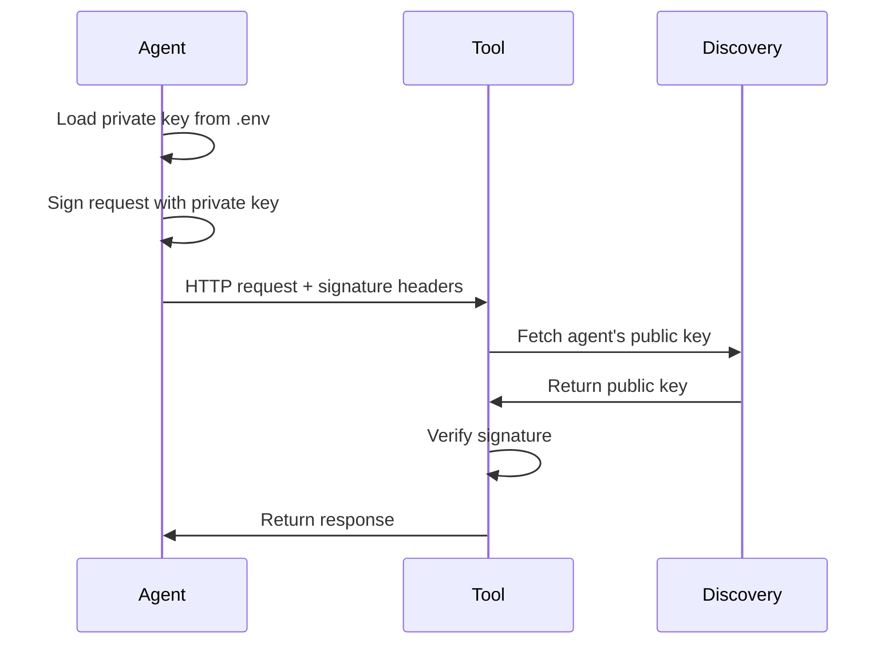

## Overview

Tools are HTTP services that agents can call to perform actions. Tools verify agent identities using Vestauth signatures, enabling secure agent-to-service communication without API keys or bearer tokens.

## What is a Tool?

A tool is any HTTP API endpoint that:

1. Accepts requests from Vestauth agents
2. Verifies agent signatures using `vestauth.tool.verify`
3. Returns responses to authenticated agents

Tools can be:
- File storage systems
- Email services
- Database APIs
- Notification systems
- Any HTTP service

<Info>
Tools authenticate agents using cryptographic signatures instead of API keys, making them more secure and easier to manage.
</Info>

## How Agents Call Tools

Agents use the `vestauth agent curl` command to make authenticated requests:

```bash
vestauth agent curl https://sfs.vestauth.com/write -d '{"filepath":"/hello.md", "content":"hello"}'
```

This automatically:
1. Signs the request with the agent's private key
2. Adds signature headers (`Signature`, `Signature-Input`, `Signature-Agent`)
3. Sends the request to the tool
4. Returns the response

### Request Flow



## First-Party Tools

Vestauth provides official tools hosted at vestauth.com:

### SFS (Simple File System)

A simple file system for agents:

```bash
# Write a file
vestauth agent curl https://sfs.vestauth.com/write \
  -d '{"filepath":"/hello.md", "content":"hello"}'

# Read a file
vestauth agent curl https://sfs.vestauth.com/read \
  -d '{"filepath":"/hello.md"}'

# List files
vestauth agent curl https://sfs.vestauth.com/list

# Delete a file
vestauth agent curl https://sfs.vestauth.com/delete \
  -d '{"filepath":"/hello.md"}'
```

<Note>
Files are scoped to each agent by UID. Agents can only access their own files.
</Note>

### GEO (Latitude and Longitude)

Returns geographic location information:

```bash
vestauth agent curl https://geo.vestauth.com/geo
```

Response:
```json
{
  "latitude": 37.7749,
  "longitude": -122.4194,
  "city": "San Francisco",
  "country": "US"
}
```

## Third-Party Tools

Anyone can build tools that work with Vestauth agents:

### AS2 (Agentic Secret Storage)

Secure secret storage from dotenvx:

```bash
# Set a secret
vestauth agent curl https://as2.dotenvx.com/set \
  -d '{"KEY":"value"}'

# Get all secrets
vestauth agent curl https://as2.dotenvx.com/get

# Get specific secret
vestauth agent curl "https://as2.dotenvx.com/get?key=KEY"
```

### Docle (Email Verification)

Check if email addresses are real:

```bash
# Verify an email
vestauth agent curl https://docle.co/api/verify \
  -d '{"emails":["test@example.com"]}'

# Check usage
vestauth agent curl https://docle.co/api/agent/usage
```

<Info>
Third-party tools integrate with Vestauth by using the verification library. No special registration required.
</Info>

## Building Your Own Tool

Create a tool in three steps:

### 1. Install Vestauth

```bash
npm install vestauth
```

### 2. Verify Agent Requests

Add verification to your endpoint:

```javascript
const express = require('express')
const vestauth = require('vestauth')

const app = express()
app.use(express.json())

app.post('/api/action', async (req, res) => {
  try {
    // Verify the agent's signature
    const url = `${req.protocol}://${req.get('host')}${req.originalUrl}`
    const agent = await vestauth.tool.verify(req.method, url, req.headers)

    // Agent is verified - process the request
    console.log('Authenticated agent:', agent.uid)

    // Your tool logic here
    const result = doSomething(req.body)

    res.json({ success: true, result })
  } catch (err) {
    // Signature verification failed
    res.status(401).json({
      code: 401,
      error: { message: err.message }
    })
  }
})

app.listen(3000)
```

### 3. Test with an Agent

```bash
vestauth agent curl http://localhost:3000/api/action \
  -d '{"data":"value"}'
```

<Accordion title="How verification works">
The `vestauth.tool.verify` function:

1. Extracts signature headers from the request
2. Parses the `Signature-Agent` header to get the agent UID
3. Fetches the agent's public key from their discovery endpoint
4. Verifies the signature matches the request
5. Returns the verified agent identity or throws an error
</Accordion>

## Tool Verification Implementation

Here's how `vestauth.tool.verify` works under the hood:

```javascript src/lib/helpers/toolVerify.js
const verify = require('./verify')
const parseSignatureAgentHeader = require('./parseSignatureAgentHeader')
const extractHostAndHostname = require('./extractHostAndHostname')
const trustedFqdn = require('./trustedFqdn')

async function toolVerify (httpMethod, uri, headers = {}, serverHostname = null) {
  const signatureAgent = headers['Signature-Agent'] || headers['signature-agent']
  if (!signatureAgent) {
    throw new Error('Missing Signature-Agent header')
  }

  const { value } = parseSignatureAgentHeader(signatureAgent)
  const { host } = extractHostAndHostname(value)
  const fqdn = host

  // Verify the discovery domain is trusted
  if (!trustedFqdn(fqdn, serverHostname)) {
    throw new Error('Untrusted Signature-Agent domain')
  }

  return verify(httpMethod, uri, headers)
}
```

## Agent Scoping

Each verified request includes the agent's UID:

```javascript
const agent = await vestauth.tool.verify(req.method, url, req.headers)
console.log(agent.uid) // "agent-4b94ccd425e939fac5016b6b"
```

Use this to scope data, track usage, or implement permissions:

```javascript
app.post('/api/data', async (req, res) => {
  const agent = await vestauth.tool.verify(req.method, url, req.headers)

  // Scope to this agent
  const data = await db.query(
    'SELECT * FROM data WHERE agent_uid = ?',
    [agent.uid]
  )

  res.json({ data })
})
```

## Tool Security

### SSRF Prevention

Vestauth prevents Server-Side Request Forgery by restricting public key discovery to trusted domains:

```javascript
// By default, only *.api.vestauth.com is trusted
const agent = await vestauth.tool.verify(req.method, url, req.headers)
```

For self-hosted agents, configure trusted domains:

```bash
export TOOL_FQDN_REGEX=".*\.agents\.vestauth\.com|.*\.agents\.example\.internal"
```

<Warning>
Only add trusted domains to `TOOL_FQDN_REGEX`. Vestauth will fetch public keys from these domains.
</Warning>

### Request Validation

Always validate request data after verifying the agent:

```javascript
const agent = await vestauth.tool.verify(req.method, url, req.headers)

// Verify agent is allowed to perform this action
if (!isAllowed(agent.uid, req.body.action)) {
  return res.status(403).json({ error: 'Forbidden' })
}

// Validate request payload
if (!req.body.filepath || typeof req.body.filepath !== 'string') {
  return res.status(400).json({ error: 'Invalid filepath' })
}
```

### Rate Limiting

Implement rate limiting per agent UID:

```javascript
const rateLimit = require('express-rate-limit')

const limiter = rateLimit({
  windowMs: 15 * 60 * 1000, // 15 minutes
  max: 100, // limit each agent to 100 requests per windowMs
  keyGenerator: async (req) => {
    const url = `${req.protocol}://${req.get('host')}${req.originalUrl}`
    const agent = await vestauth.tool.verify(req.method, url, req.headers)
    return agent.uid
  }
})

app.use('/api/', limiter)
```

## Tool Discovery

Tools don't require registration with Vestauth. Agents can call any tool by URL:

```bash
vestauth agent curl https://your-tool.com/api/action
```

The tool verifies the agent by:
1. Checking the signature
2. Fetching the public key from the agent's discovery endpoint
3. Validating the signature matches

<Note>
Tools and agents discover each other through standard HTTP and `.well-known` endpoints. No central registry required.
</Note>

## Primitives API

For advanced use cases, use the primitives API directly:

```javascript
const vestauth = require('vestauth')

// Verify without fetching public key
const publicJwk = getPublicKeyFromCache()
await vestauth.primitives.verify(httpMethod, url, headers, publicJwk)

// Generate signatures
const headers = await vestauth.primitives.headers(
  'POST',
  'https://example.com/api',
  'agent-123',
  privateJwk
)
```

## Tool Development Tips

<Accordion title="Cache public keys">
Cache agent public keys to reduce discovery requests:

```javascript
const cache = new Map()

const getPublicKey = async (uid) => {
  if (cache.has(uid)) {
    return cache.get(uid)
  }
  const agent = await vestauth.tool.verify(...)
  cache.set(uid, agent.public_jwk)
  return agent.public_jwk
}
```
</Accordion>

<Accordion title="Return clear errors">
Help agents debug by returning clear error messages:

```javascript
try {
  const agent = await vestauth.tool.verify(...)
} catch (err) {
  if (err.message.includes('expired')) {
    return res.status(401).json({
      error: 'Signature expired',
      hint: 'Clock skew or signature older than 5 minutes'
    })
  }
}
```
</Accordion>

<Accordion title="Log agent activity">
Track which agents use your tool:

```javascript
const agent = await vestauth.tool.verify(...)
await logActivity({
  agent_uid: agent.uid,
  action: req.body.action,
  timestamp: new Date()
})
```
</Accordion>

## Next Steps

<CardGroup cols={2}>
  <Card title="Authentication" icon="shield" href="/concepts/authentication">
    Learn how signature verification works
  </Card>
  <Card title="Standards" icon="book" href="/concepts/standards">
    Understand RFC 9421 and Web-Bot-Auth
  </Card>
</CardGroup>